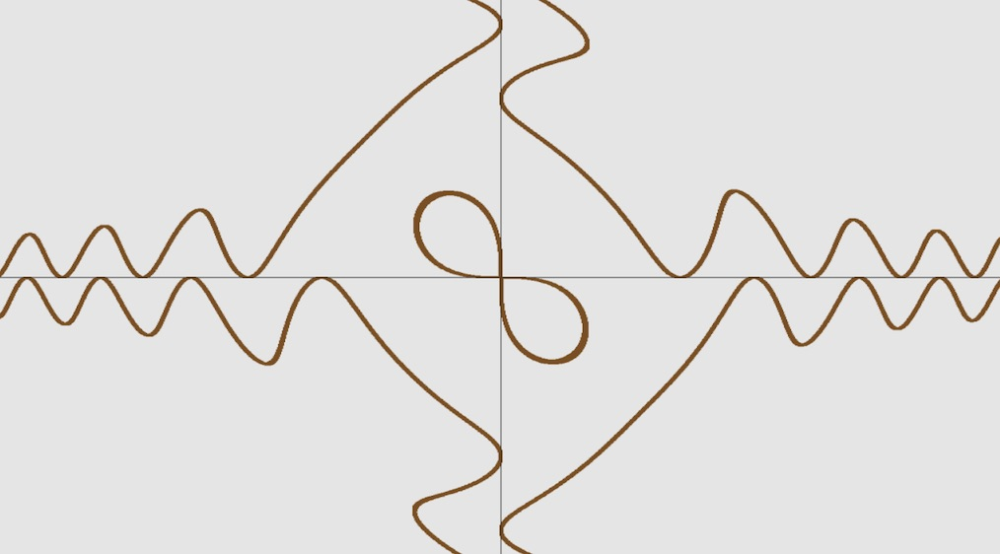

# plasm
A FAST mathematical function plotter which builds to both desktop (Rust + OpenGL) and web (Rust to WebAssembly).

[**homepage**](https://plasm.acqua.team/)

[](https://plasm.acqua.team/)

## Build
### Desktop
```console
$ cargo run
```

### Web
```console
$ wasm-pack build --target web --out-name web --out-dir pkg
```
Install a server that properly defines the `application/wasm` mime type for example:
```console
$ npm install -g http-server
```
Start the server
```console
$ http-server
``` 
Go to http://localhost:8080 in a browser.


## Current feature
2D (implicit and explicit) and 3D mathematical functions plotter.

## API
Make a GET request to `https://plasm.acqua.team/` with a GET parameter `"q"` containing the mathematical expression \
For example:
```
https://plasm.acqua.team/?q=sin%28x%29%2Bcos%28y%29
```





## License

Distributed under the MIT License. See `LICENSE` for more information.


## Contact

- Francesco Magliocca - [@Franciman]()
- Francesco Pham - [@Frankplus](https://www.linkedin.com/in/francesco-pham-54128486/)


<!-- ACKNOWLEDGEMENTS -->
## Acknowledgements

* @Franciman
* @Frankplus
